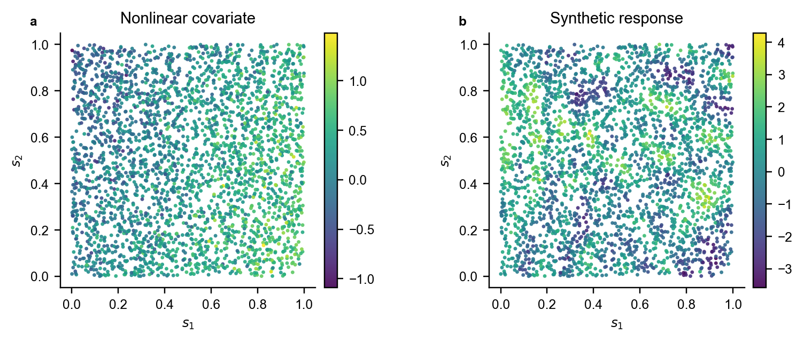

# ASDKL: Adaptive Spectral Deep Kernel Learning

Official implementation accompanying the ASDKL manuscript. This repository contains only the proposed ASDKL method and its supporting synthetic-data generator, data utilities, deterministic split utilities, ablation and sensitivity runners, tests, and plotting code.

Baseline implementations, trained checkpoints, logs, result tables, result CSVs, and rendered manuscript figures are intentionally excluded. The only included image is this generator-only preview:



Regenerate it with `python examples/generate_synthetic_example.py`.

## Model implementation

The evaluated ASDKL implementation contains a local context encoder; target-conditioned Fourier frequencies shared by each target and its candidate neighbours; an explicit relative relation encoder using coordinate differences, covariate differences, and distance; spectral target-neighbour attention; gated aggregation; a six-block residual nonlinear mean network with a local anchor; and an additive residual covariance using representation-space and base-coordinate RBF kernels.

Full residual-covariance inference is used for the complete synthetic and EPA PM2.5 datasets. A 32-neighbour predictive-local residual approximation is used for complete LUCAS and California. See `methods/ASDKL/` and `configs/formal_protocol.json`.

## Layout

```text
common/       datasets, preprocessing and splits
configs/      frozen manuscript protocol
examples/     synthetic generator preview
figure/       plotting code only
methods/      ASDKL implementation and experiment runners
scripts/      split generation and audits
tests/        smoke and structural tests
data/         external-data instructions
```

## Installation

Python 3.9 was used for the manuscript experiments.

```bash
conda env create -f environment.yml
conda activate asdkl
```

Alternatively install `requirements.txt` in a virtual environment. Select the PyTorch build appropriate for the local CUDA driver.

## Data and evaluation protocol

The synthetic benchmark is generated locally. EPA AirData, LUCAS Topsoil, and California Housing are external datasets; see `data/README.md`.

All four complete datasets use seeds 1042, 1052, 1062, 1072, and 1082 with seed-specific 70%/10%/20% train-validation-test partitions. Preprocessing is fitted using training observations only. Training queries exclude themselves from their neighbourhoods; validation and test queries reference training observations only. Repeated EPA coordinates remain distinct response records. The reduced-observation EPA experiment groups equal coordinates so a location cannot cross partitions.

## Run ASDKL

Quick CPU smoke run:

```bash
python methods/ASDKL/run.py --dataset synthetic --seed 1042 --max-samples 300 --epochs 2 --device cpu --gp-refine-steps 0 --data-root data --output-dir results/smoke
```

Complete four-dataset, five-seed protocol:

```bash
python methods/ASDKL/experiments/run_main.py --data-root data --output-dir results/asdkl_main --device cuda
```

The 300 epochs are an upper budget. Validation MSE selects the checkpoint; test responses are not used for fitting, preprocessing, calibration, or selection.


## Ablations and sensitivity

```bash
python methods/ASDKL/experiments/ablation/run_modules.py --data-root data --output-dir results/ablations/modules --device cuda
python methods/ASDKL/experiments/ablation/run_kernels.py --data-root data --output-dir results/ablations/kernels --device cuda
python methods/ASDKL/experiments/ablation/run_sensitivity.py --data-root data --output-dir results/sensitivity --device cuda
```

The structural runner independently tests neighbour-specific rather than shared frequencies and removal of the target-neighbour relation encoder. The kernel runner covers all four complete datasets.

## Reduced-observation EPA study

```bash
python methods/ASDKL/experiments/sparse_observations/run_epa_sparse_fraction_study.py --device cuda --epochs 300 --output-dir results/epa_sparse
```

Training percentages are 10, 20, 30, 40, 50, 60, and 70, with a fixed 20% coordinate-grouped test set and 10% validation set for every seed.

## Plotting code

`figure/` contains plotting code only. Result-dependent figures must be regenerated after the corresponding experiments; result CSVs and rendered result figures are not included.

## Verification

```bash
python -m unittest discover -s tests -v
```

## Citation and code availability

Repository: https://github.com/bll744958765/ASDKL

The final paper citation and DOI will be added after publication.

## License

No license is asserted here. Add the authors' selected software license before public release.


